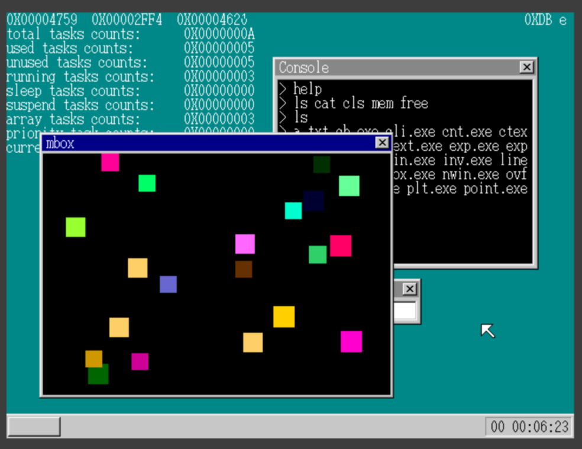

这是一个根据[Linux操作系统-构建自己的内核](https://www.bilibili.com/video/BV1VJ41157wq?spm_id_from=333.788.videopod.episodes&vd_source=da23da82658adda9cbdfd045a9e6daf7)课程的学习项目。


### 如何使用该项目？
- 编译启动镜像：`make`
- 启动`virtualbox`，创建一个虚拟机，虚拟机以软盘启动。软盘加载`build/disk.img`作为启动镜像.


### 实现功能
- 运行在保护模式下
- 处理鼠标和键盘输入
- 简单的定时器
- 简单的内存管理
- 简单的图层管理，保证图层及时刷新
- 简单的任务调度
- 一个输入框，可以输入和删除字符


### 构建工具
- gcc: `gcc (GCC) 13.3.0`
- objconv: `Object file converter version 2.54 for x86 and x86-64 platforms`
- nasm: `NASM version 2.16.03 compiled on Apr 17 2024`


### 问题: 无法再添加代码
添加一些无关紧要的代码，甚至没有调用这些代码。只是将这些代码添加到内核文件中，构建的内核启动镜像就无法启动。具体可以查看`dummy.c`的代码，将注释的代码重新打开，并重新构建内核镜像。

经过分析怀疑是`objconv`的问题，可能是反汇编出来的代码在调用的时候有代码长度的限制。例如超过一定长度偏移的代码调用会出问题。这个问题无法解决，就无法继续课程后续的功能。如果有头绪，欢迎提交issue。


### 注意事项
- 整个结构体赋值会出问题，导致整个程序异常退出。应该是objconv反汇编出问题。
```
struct Foo {
    int a;
    int b;
}

Foo a = { .a = 0, .b = 0 };
Foo b = a; // 此处会出问题，可能导致内核在刚启动就异常退出，而不是代码运行到此处
```


### 参考
- [Linux操作系统-构建自己的内核](https://www.bilibili.com/video/BV1VJ41157wq?spm_id_from=333.788.videopod.episodes&vd_source=da23da82658adda9cbdfd045a9e6daf7)
- [课程代码github](https://github.com/wycl16514)
- [重点课程：从实模式进入保护模式](https://www.bilibili.com/video/BV1VJ41157wq?spm_id_from=333.788.player.switch&vd_source=da23da82658adda9cbdfd045a9e6daf7&p=5)
